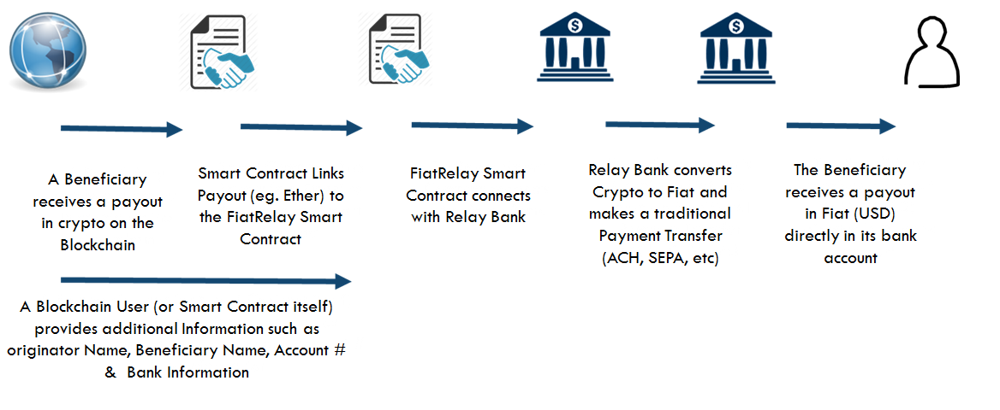
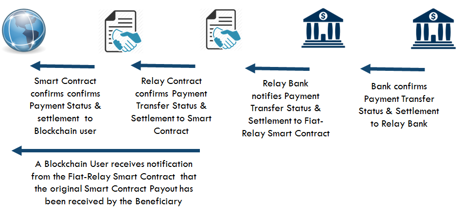
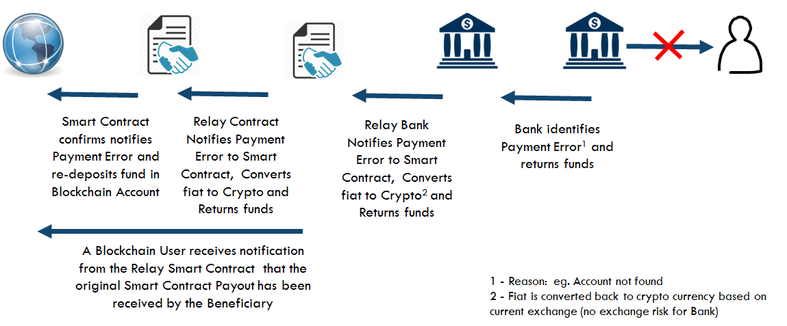
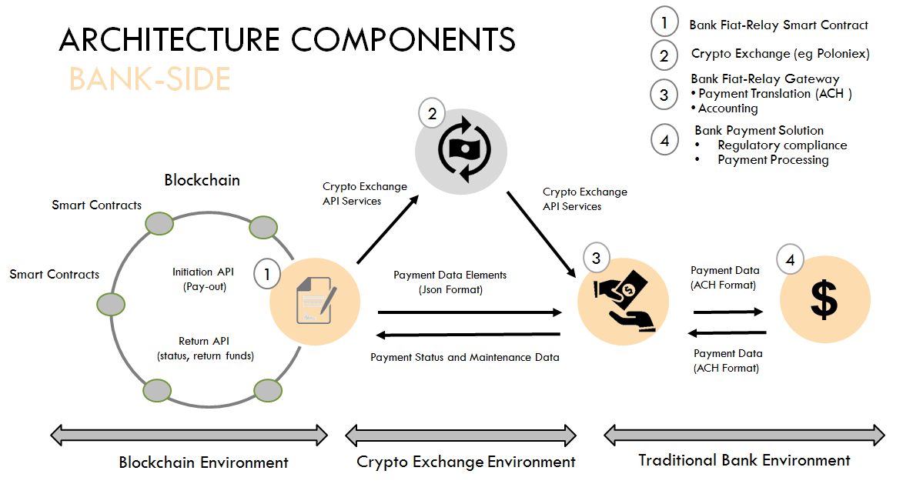

# Fiat-Relay

Fiat-Relay Smart contract is both an Ethereum Smart Contract and a Banking solution that covers one of the critical and immediate needs for the blockchain industry and Ethereum. Namely, to provide a low cost, fast and automated solution for an Ether pay-out of a smart contract execution to a beneficiary on the Ethereum blockchain.

Currently, in Ethereum any value transactions that is managed  or is the outcome of a Smart Contracts is based in Ether, the crypto-currency underpinning the Ethereum Blockchain. Other Blockchains are dealing in BTC or other types of crypto currencies. Due to the nature of the blockchain technology Fiat currency can only be obtained after a user converts his or her crypto currency via a Crypto-Exchange (Poloniex, ShapeShift, etc) and instructs this Crypto-Exchange to pay-out the converted fiat amount back to the user's bank account on file. This process requires multiple steps by the user, and could lead up to 5-7 days of processing before the final fiat converted amount is deposited on a traditional bank account.

Fiat Relay is an open-source initiative designed by Capgemini and participating financial institutions to provide an automated solution for existing smart contracts on the Ethereum Blockchain to immediately connect with:
1. a service to exchange crypto currency to fiat currency (USD initially)
1. a payment delivery of the converted fiat amount through the regular banking payment network to an identified beneficiary

With the Fiat-Relay solution, a user is no longer required to become a client of an existing Crypto-Exchange. This also removes any manual action from the beneficiary for receiving his/her  pay-out amount in fiat currency (USD), provided that all mandatory and required payment information is available to the Fiat-Relay Smart Contract and the Financial Institution providing the payment service.

This Fiat-Relay solution is available initially in its pilot phase to a specific set of Ethereum contract to provide this automated exchange and payment service. In a future phase the service will be available for all Ethereum contracts that are executing logic and have created a pay-out of Ether for a specific Ethereum Account. For a Smart contract to take advantage of this functionality the Smart Contract must be upgraded with additional Solidity Code that defines the additional payment beneficiary information that is required and the Smart-Relay End-point that it is connecting to for the payment service.  There could be one or more Smart-Relay end points available for the Smart Contract to connect to as  multiple geographical Financial Institution can provide a specific offering connecting to different international and local payment networks

Any Smart Contract that wants to connect and leverage the services for auto-exchange and payment service offering provided by the participating Financial Institutions will be required to pay for the execution of the Fiat-Relay Smart Contract (Ethereum Gas). The Smart Contract will also be required to pay a predefined service fee to the Participating Financial Institution according to the terms of the Service Agreement of the Fiat-Relay Smart Contract.

## Functionality
The main functionality that the Fiat-Relay Solution provides includes:

1. Verification and validation of an Ethereum message that contains the Ether that is specified to be paid to a beneficiary: In this case, an Ethereum Contract has provided a payment for X Ether to the Fiat-Relay Smart Contract.
1. Verification that the payment details information required  for the disbursement of the converted Ether amount to the beneficiary is available and correct.
1. Ability to immediately and automatically convert Ether to Fiat currency using a participating Crypto-Exchange provider
1. Ability to update the payment status based on the information received from the Bank and the traditional Payment network
1. Ability to return any Ether Balance back to the Originating Ethereum contract in case of failures (eg. insufficient or incorrect payment information, suspicious payment activity, etc). This maybe the full or only partial balance based on the market conditions and currency fluctuations. A Service Return-fee maybe applied to prevent any spam or suspicious requests to leverage the Fiat-Relay service offering

Note: In Ethereum,  Contracts have the ability to send "messages" to other contracts. Messages are virtual objects that are never serialized and exist only in the Ethereum execution environment. A message contains:
* The sender of the message (implicit)
* The recipient of the message (in this case the Fiat-Relay Smart Contract End Point)
* The amount of ether to transfer alongside the message: This is the amount of Ether to be converted to USD by the Fiat-Relay Contract
* Optional data fields (See Payment Information section)
* A Startgas value: Gas applies to the total gas that will be consumed by the Fiat-Relay Smart Contract.

----

# How it works
## Fiat Conversion and Payment

The following diagram covers the base current and Fiat-Relay flow scenario where a Smart Contract has created a pay-out for a beneficiary in crypto-currency.  This crypto-currency is consequently exchanged in fiat currency and a payment transfer is made to the identified beneficiary account holder who will receive the pay-out in his/her account 2-3 days later (based on the payment services SLA's from bank and the payment network)

In the current workflow the base functionality can be accomplished by transfering the Ether Balance to  Crypto-Currency Exchange (eg. Poloniex), make an exchange transaction and request a Pay-out to the Bank Account on file. In this case, the Crypto Exchange will work with its banking partner to initiate a traditional payment to the Beneficiary on file.

Diagram 1

</a>


The following advantages are applicable to the Fiat-Relay process:  
* User does not require an account with a Crypto-Exchange: The service to convert crypto-currency is provided by the participating Financial Institution and therefore the user is not required to have an account with an existing Crypto-Exchange. Crypto-Exchange providers have been a real traget for hacks and heist. Leaving crypto currencies or fiat amounts on a Crypto-Exchange are considered risky and could lead to stolen funds in case of irregularities at the Crypto-Exchange.
* User does not require any manual actions to:
 - move Ether balance from an Ethereum Account to the Crypto-Exchange Account
 - make one or more trades at a Crypto-Exchange
 - request a Pay-out in Fiat currency. This may be restricted with additional security measures such as email confirmations and may be limited to maximum daily pay-out.
* Due to the automated services provided by the Financial Institution the end to end process can be accelerated by 30-50%. In case the Beneficiary is a current client at the Participating Financial Institution then this could lead to even a faster payment pay-out.

## Payment Status Notification

In the diagram below, the scenario describes the current and Fiat-Relay functionality  the Fiat-Relay Smart Contract and Relay Bank provide to to the original smart contract regarding the status update of the payment transfer and final settlement

In the current state workflow only very limited status information is available. The original Smart Contract will not have any knowledge of the outcome of the payment process initiated for paying out the fiat amount to the Beneficiary. In most cases the Crypto-Exchange does not either provide any updates regarding the payment status and the final settlement provided within the banking system.  The user can manually verify if any funds were deposited on its bank account or may be notified by the Crypto-Exchange in case the funds transfer did not succeed. In this case, the user will need to initiate a customer service request to get additional details or Crypto Exchange will work with its banking partner to initiate a traditional payment to the Beneficiary on file.

In case of the Fiat-Relay solution, the status and settlement information from the Payment Network can be relayed to the Fiat-Relay Smart Contract. The Smart Contract can consequently be notified with an additional message with a status update of the payment status. This transaction update message will require some additional gas and will be covered by the Smart Contract initiating the Transaction.  This could potentially a Pull transaction by the original Smart Contract or a Push transaction by the Fiat-Relay Smart Contract


Diagram 2

</a>

The following advantages are applicable to the Fiat-Relay solution:
* automated payment status notification: The Relay Bank is the owner of the Fiat Relay Smart Contract and can make the status and Settlement update available to Smart Contracts
* the Relay Bank can provide additional (optional) status notifications to the beneficiary such as a notifications by email or text.

## Payment Return process

In the diagram below, the scenario describes the current and Fiat-Relay situation where a payment was not successful. This could be related to missing or incorrect account information. In this case the fiat amount is converted back to the original crypto currency, using a Crypto-Exchange. This is done at the spot rate, which could lead to an increase or decrease of the original crypto amount.
In case of a failed payment, the money is likely redeposited at the user's account at the Crypto-Exchange. The user will either try to make another pay-out with correct beneficiary information or convert the amount back to crypto and move the crypto currency of the exchange.
In the case of the Fiat-Relay process, the amount is automated and deposited back to the return address specified in the original transaction by the Smart Contract.

Diagram 3

</a>


The following advantages are applicable to the Fiat-Relay solution:
* automated return process : The Relay Bank is the owner of the Fiat Relay Smart Contract and is able to return and redeposit the crypto currency at the original or specified Ethereum address
* Crypto Exchange Risk: Funds are only temporarily held an Exchange which reduces the risk of theft.

## Benefits/considerations for Participating Financial Institutions

To be completed

## Architecture

The Fiat-Relay solution contains a number of different components:

1. A Fiat-Relay Smart Contract: This is an Ethereum contract that can be leveraged by other Ethereum Contracts for paying a Beneficiary Person, Company or Organization the Fiat equivalent of the Ether Balance on an Ethereum Account
1. A Crypto Exchange:   This is an automated and real-time Ether-to-Fiat Exchange (using a participating Crypto-Exchange provider (eg. Poloniex or, in the future Coinbase)
1. A Bank Payment Module: This is a Bank application that stores all records of the transactions and provides tools for customer service reps to investigate or follow up on on specific customer service issues. It provides payment translation services and integrates with the banks accounting system
1. A Bank Payment Processor: This is a traditional bank payment solution leveraged to provide payment services for clients of the bank

 </a>


Future Development:

1. A Customer Portal: This is a Bank Application that provides a customer friendly Blockexplorer view of the blokchain transactions and data available in the smart contract
1. A Mobile Notification Service: This notifies the User about the status of the payment


----

# Fiat Relay Smart Contract (Ethereum)

For the Fiat-Relay contract and the payment transfer service to be successful, additional payment information is necessary.

This information is required:
* to identify the originator of the transaction
* to identify the beneficiary for the payment service
* and to guarantee compliance with all applicable laws (including AML, KYC and others as required)

Note: based on regulatory guidelines in the initial phase of the project the maximum fiat equivalent payment to any beneficiary is set to 1000 USD per transaction

The following payment information is required for the Fiat-Relay smart contract:
* `Originator Name`
* `Originator address 1`
* `Originator Address 2` - Optional
* `Originator City`
* `Originator State`
* `Originator Country`
* `Originator Telephone` - Optional
* `Originator email address` - Optional
* `Originator blockchain identity` (eg. Onename ID) - Optional
* `Beneficiary Name`
* `Beneficiary Bank Account number`
* `Beneficiary Bank ABA Number`
* `Beneficiary address 1`
* `Beneficiary Address 2` - Optional
* `Beneficiary City`
* `Beneficiary State`
* `Beneficiary Country`
* `Beneficiary Telephone` - Optional
* `Beneficiary email address` - Optional
* `Beneficiary blockchain identity (eg, Onename ID)` - Optional
* `Ether amount to transfer`
* `Ethereum Originating Account` - This is the  smart contract initiating the transaction
* `Ethereum Bank Account` - this is the bank owned Ethereum Account that will receive the funds in Ether
* `Return Ethereum Address` - This is the return address incase the payment transaction is incomplete or invalid
* `Reference Message` - Description that travels with the payment transaction

For payment services exceeding 3000 USD additional payment information maybe required
(see  FinCen regulation for Money Transmitters -  http://www.ecfr.gov/cgi-bin/text-idx?SID=2df5ac33e4575e7be6e95689037843e1&mc=true&node=se31.3.1010_1410&rgn=div8)

----
# Bank Payment Module

The Bank Payment Module is a bank specific and bank owned software solution that links the Fiat-Relay Smart Contract to the internal processes of the participating Bank including payment services, compliance services, and accounting services. This module provides a structured service to oversee one or more payment transactions for a customer, taking into account customer specific rules and constraints.

The following key capabilities are considered for this processes

1. Payments Execution : Orchestrate the execution of payment transactions, with, and between bank using any appropriate payment mechanism (A/C, wire, ACH). This also includes translation and validation service of the specific format and associated rules

1. Position Keeping:  This includes administering the financial transaction records.  This tracking will typically involve some form of double entry capture for integrity assurance and will be used for all aspects of fulfillment - e.g. transaction management, position derivation and financial booking.

1. Regulatory Compliance:  This includes all  regulatory requirements and defines a portfolio of regulatory compliance tests for the specific payment.

1. Payment Support: This includes support function capabilities to monitor the Blockchain network, to view customer and transaction details and status, to query balances of bank-owned accounts, and initiate transactions.

1. Transaction Reporting: This includes ability to run realtime and historic reports to analyze usage and revenue trends. This also allows to look at usage trends regarding originators and beneficiaries.

1. Exchange Services: This includes the setup, maintenance and transaction services to exchange crypto-currency to fiat using the API services available through the Crypto-Exchange.

1. Transaction return process : This includes capabilities to initiate return process of the fiat, convert it back to crypto-currency and transmit it to original account address or the specified return account address

## Use cases

Below you can find an inventory of use cases that are associated with the requirements for building the Bank Payment Module. Please note that this list of use cases and requirements can vary per financial institution and is therefore only indicative

* UC1 : Login User/Administator: this could be a login to the web application or can be covered by an SSO or oAuth service
* UC 2: View/Edit user preferences
* UC 3: View payment queue
* UC 4: Connect to Crypto-Exchange
* UC 5: Initiate crypto-fiat exchange transfer
* UC 6: Initiate Transfer to Payment Transfer Network
* UC 7: View payment details
* UC 8: Initiate compliance check
* UC 9: Initiate accounting transaction
* UC 10: Initiate refund transaction
* UC 11: Initiate reconciliation process
* UC 12: View dashboard
* UC 13: Search transaction, customer
* UC 14: View reporting list
* UC 15: View reports
* UC 16: View Blockchain network, account, transaction  information
* UC 17: View transaction status
* UC 18: View/Edit Administrator module
* UC 19: view Bank-Account information
* UC 20: Initiate manual transfer
* UC 21: Initiate manual Ethereum transaction


---

# API Services

There following API services are referenced and are build in the Bank Payment module to automate the process workflow for connecting the Relay Contract to the Payment Network inside the bank. The following 2 categories apply:

1. API services for exchanging Crypto-currency to Fiat on an participating crypto-currency
1. API services to update "Status" of a Transaction
1. API service for Support Functions


## API Services for Exchanging Crypto to Fiat on a participating Crypto-Exchange


For exchanging crypto-currency to fiat the Fiat Relay will use an existing set of API services offered by a Crypto-Exchange. In the examples below, the APIs from Poloniex Exchange are referenced for illustrative purposes. for additional documentation and information - please refer to https://poloniex.com/support/api/

These APIs will be executed from the "Bank Payment Module" and allows the Bank to transfer Crypto currencies to be replaced by Fiat currency on its bank account at the Crypto-Exchange

### Sell - API

This is used to create a a limit Sell order in a given market. The following parameters are required :
* `currencyPair`
* `rate`
* `amount`

Additional optional parameters include:
* `fillOrKill`: This instructs the Exchange to either fill the order in its entirety or be completely aborted
* `immediateOrCancel`: This instructs the Exchange to  partially or completely fill the trade, but any portion of the order that cannot be filled immediately will be canceled rather than left on the order book

If successful, the method will return the order number and additional information on the trade

Sample output (Poloniex)
```
{"orderNumber":31226040,"resultingTrades":[{"amount":"338.8732","date":"2014-10-18 23:03:21","rate":"0.00000173","total":"0.00058625","tradeID":"16164","type":"sell"}]}
```
### Buy API Service
For a Buy order, the parameters and output are the same as for the Sell method.

### CancelOrder API Service

This instruction is used to cancels an order that has been placed in a given market. The following parameter is required:
* `orderNumber`

 If successful, the method will return:

```
{"success":1}
```

### Withdraw API service

This API service allows for the immediate withdrawal for a given crypto currency, with no email confirmation.
In order to use this method, the withdrawal privilege must be enabled for your API key.

The following are required parameters
* `currency`
* `amount`
* `address`

Sample output:
```
{"response":"Withdrew 2398 NXT."}
```

### WithdrawFiat API service
This API will automate the transfer or sweep at specified intervals and at the end of the Day the collected  Fiat Currency from the Bank's Account at the Exchange to an internal Bank Account.  
Note: Currently this functionality is not available on Poloniex.


For more information on Exchage API services by Poloniex, please refer to https://poloniex.com/support/api/


##API services to update "Status" of a Transaction

The purpose for these APIS's is to provide a status update to the Fiatrelay Contract the Status of the Payment on the payment network

The following status information is available:
* `PaymentStatus`
* `PaymentStatusDescription`
* `PaymentStatusUpdateDateTime`

### GetPaymentStatus API Service

The Bank module leverages the following  GetPaymentStatus API to retrieve the latest Status from the Payment system

The following are required parameters
* `PaymentID`

Sample output:
```
{"PaymentID":23455,  PaymentStatus":RelayBank Accepted ,"PaymentStatusUpdateDateTime":" Payment was Accepted by the Relay Bank", "PaymentStatusUpdateDateTime": 2016-07-01-12:00"03AM-EDT}
```

The following suggested Payment status are available
* `Initiated`
* `Bank-Relay Accepted`
* `Bank-Relay in Process`
* `Peneficiary Accepted`
* `Beneficiary in Process`
* `Payment Delivered`
* `Payment Failed`


## API Service for Support Functions

This module leverages a set of Ethereum APIs that are commercially available by BlockCypher. (© 2016 BlockCypher, Inc. Redwood City, CA) For More information on these API services, please refer to  http://dev.blockcypher.com/eth/


### Blockchain API

This contains a an APIs that provide general query capabilities about Ethereum’s blockchain and blocks. There are 2 variations based on 2 different input parameters (blockchhash or blokheight)

#### Input = blockhash
The following are required parameters
*`blockhash` : this is a string of characters representing a Hash of a certain block

additional optional parameters include:
* `txstart`: This filters response to only include transaction hashes after txstart in the block.
* `limit`: this response to only include a maximum of limit transactions hashes in the block. Maximum value allowed is 500.

Sample output:
```
'{
  "hash": "e0c7c0b46e116b874354dce6f64b8581bd239186b03f30a978e3dc38656f723a",
  "height": 7,
  "chain": "ETH.main",
  "total": 0,
  "fees": 0,
  "size": 1078,
  "ver": 0,
  "time": "2015-07-30T15:28:30Z",
  "received_time": "2015-07-30T15:28:30Z",
  "coinbase_addr": "dd2f1e6e498202e86d8f5442af596580a4f03c2c",
  "relayed_by": "",
  "nonce": 13599487003767981,
  "n_tx": 0,
  "prev_block": "1f1aed8e3694a067496c248e61879cda99b0709a1dfbacd0b693750df06b326e",
  "mrkl_root": "ff8d97d9ca01ee59c793c4da2ba4ce8c31d358b42f216ab2f11af4bb097b6a2b",
  "uncles": [
    "4b8729311c5b59f418c5154fd54d85e6a8b42eabf83a1d3c05c754a8f10354cc"
  ],
  "txids": [],
    "internal_txids": [],
  "depth": 1656646,
  "prev_block_url": "https://api.blockcypher.com/v1/eth/main/blocks/1f1aed8e3694a067496c248e61879cda99b0709a1dfbacd0b693750df06b326e",
  "tx_url": "https://api.blockcypher.com/v1/eth/main/txs/"
}'
```
#### Input = blockheight

The following are required parameters
*`blockheight` : this is a string of characters representing a Hash of a certain block

additional optional parameters include:
* `txstart`: This filters response to only include transaction hashes after txstart in the block.
* `limit`: this response to only include a maximum of limit transactions hashes in the block. Maximum value allowed is 500.

Sample output:
```
{
    "hash": "e0c7c0b46e116b874354dce6f64b8581bd239186b03f30a978e3dc38656f723a",
    "height": 7,
    "chain": "ETH.main",
    "total": 0,
    "fees": 0,
    "size": 1078,
    "ver": 0,
    "time": "2015-07-30T15:28:30Z",
    "received_time": "2015-07-30T15:28:30Z",
    "coinbase_addr": "dd2f1e6e498202e86d8f5442af596580a4f03c2c",
    "relayed_by": "",
    "nonce": 13599487003767981,
    "n_tx": 0,
    "prev_block": "1f1aed8e3694a067496c248e61879cda99b0709a1dfbacd0b693750df06b326e",
    "mrkl_root": "ff8d97d9ca01ee59c793c4da2ba4ce8c31d358b42f216ab2f11af4bb097b6a2b",
    "uncles": [
      "4b8729311c5b59f418c5154fd54d85e6a8b42eabf83a1d3c05c754a8f10354cc"
    ],
    "txids": [],
    "depth": 1656646,
    "prev_block_url": "https://api.blockcypher.com/v1/eth/main/blocks/1f1aed8e3694a067496c248e61879cda99b0709a1dfbacd0b693750df06b326e",
    "tx_url": "https://api.blockcypher.com/v1/eth/main/txs/"
  }
```

### Account Balance API
The Address Balance API can be used to get a subset of information on a public address.

To be further elaborated

### Account Transaction API
The Account Transaction API is used to provide information about the address, including its balance in wei, the number of transactions associated with it, and transaction summaries in descending order by block height.

To be further elaborated

### Generate Account Address API
The Generate Account Address API is used to  generate private-public key-pairs along with an associated public address. No information is required with this POST request.

To be further elaborated

### Transaction API

The Transaction API is used to look up information about unconfirmed transactions, query transactions based on hash, and create and propagate your own transactions.

To be further elaborated

### Create Transaction API
The Create Transaction API is used for putting a transaction on the Ethereum network

To be further elaborated

### Transaction Events
This Transaction Event API is used for listening to events related to a specific address on the Ethereum blockchain

To be further elaborated


----

# Payment network

This is an internal solution of the  participating bank. Its purpose is to provide payment services including:

1. Correspondent Bank Fulfillment:  Handle payment transactions through the correspondent relationships (with SWIFT) and some other correspondent bank related interactions
1. Financial Message Gateway: Operate automated message interfaces to secure networks such as SWIFT, TELEX, ACH and Exchange reporting services  

This generally already exists within a bank and very few changes are expected to the existing infrastructure and services already provided by the participating

----
# License

See [full MIT License](LICENSE) including:
```
THE SOFTWARE IS PROVIDED "AS IS", WITHOUT WARRANTY OF ANY KIND, EXPRESS OR
IMPLIED, INCLUDING BUT NOT LIMITED TO THE WARRANTIES OF MERCHANTABILITY,
FITNESS FOR A PARTICULAR PURPOSE AND NONINFRINGEMENT. IN NO EVENT SHALL THE
AUTHORS OR COPYRIGHT HOLDERS BE LIABLE FOR ANY CLAIM, DAMAGES OR OTHER
LIABILITY, WHETHER IN AN ACTION OF CONTRACT, TORT OR OTHERWISE, ARISING FROM,
OUT OF OR IN CONNECTION WITH THE SOFTWARE OR THE USE OR OTHER DEALINGS IN
THE SOFTWARE.
```
