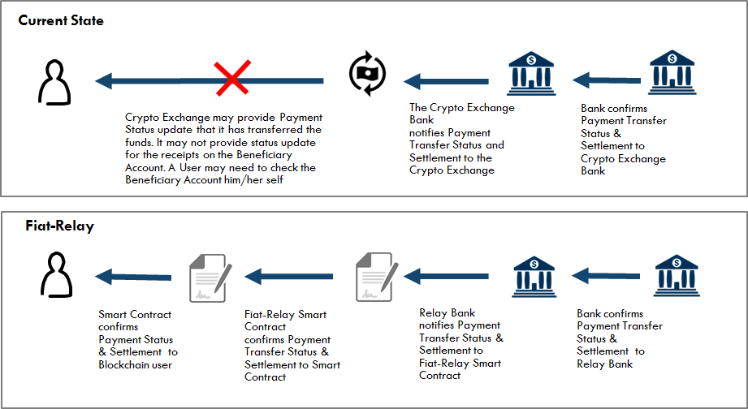
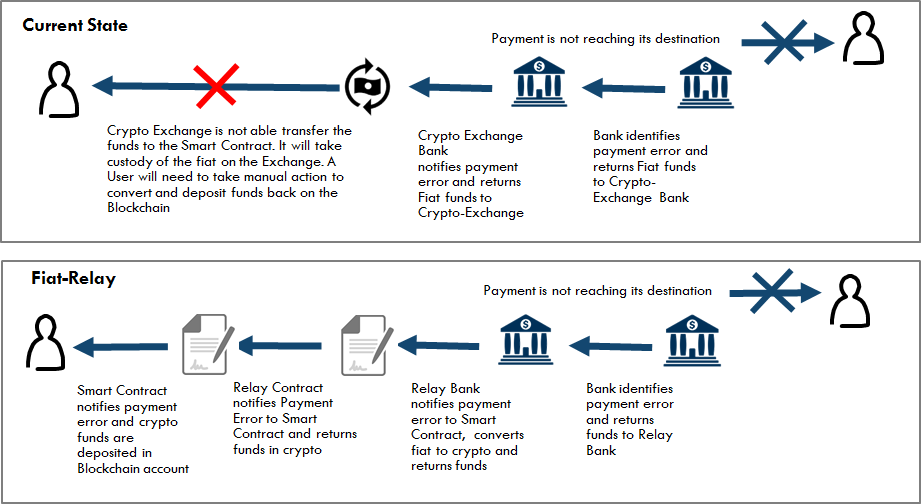

# Fiat-Relay

Fiat-Relay Smart contract is an Ethereum Smart Contract and Banking solution that covers one of the immediate needs for the blockchain industry. Namely, to provide an low cost, fast and automated solution for pay-out of any Ether Balance to a beneficiary that is the outcome of a Smart Contract execution on the Ethereum blockchain.

Currently Smart contracts on Ethereum network are transactiong in Ether, the crypto-currency underpinning the Ethereum Blockchain. Other Blockchains are dealing in BTC or other types of crypto currency. Due to the nature of the blockchain technology fiat currency can only be obtained after a user converts his or her crypto currency via a Crypto-Exchange (Poloniex, ShapeShift, etc) and instructs the Crypto-Exchange to pay-out the converetd fiat currency back to the user's bank account on file. This process requires multiple steps by the user, and could lead up to 5-7 days of processing before final fiat converted amount is deposited on a bank account.

Fiat Relay is an open-source initiative designed by Capgemini and participating financial institutions to provide an automated solution for existing smart contracts on Ethereum to immediately connect with:
1. a service to exchange  crypto currency to fiat and
1. for payment delivery of the converted fiat amount through the regular banking payment network to an identified beneficiary.  

This solution no longer requires a user to become a client of an existing crypto exchange and removes any manual action from the beneficiary for receiving his/her  pay-out amount in USD, provided that all mandatory and required payment information is available to the Fiat-Relay Smart Contract.

## Functionality
The main functionality this solution provides includes:

1. Verification of an Ethereum message that contains the Ether that is specified to be paid to a beneficiary
(eg. An Ethereum Contract has provided a payment for X amount of Ether to the Fiat-Relay smart contract)
1. Verification that the payment details information is available for the disbursement of the converted Ether amount to the beneficiary
1. Ability to immediately and automatically convert Ether to Fiat using a participating crypto-Exchange provider
1. Ability to update the payment status based on the information received from the Bank and the Fiat Payment network
1. Ability to return Any Ether funds back to the Originating Ethereum contract in case of failures (eg. insufficient or incorrect payment information, suspicious payment activity, etc)

Note: In Ethereum Contracts have the ability to send "messages" to other contracts. Messages are virtual objects that are never serialized and exist only in the Ethereum execution environment. A message contains:
* The sender of the message (implicit)
* The recipient of the message (in this case the fiat-relay smart contract)
* The amount of ether to transfer alongside the message: This is the amount to be converted
* Optional data fields (See Payment Information section)
* A STARTGAS value

Note: The gas allowance assigned by a transaction or contract applies to the total gas consumed by that transaction and all sub-executions. For example, if an external actor A sends a transaction to B with 1000 gas, and B consumes 600 gas before sending a message to C, and the internal execution of C consumes 300 gas before returning, then B can spend another 100 gas before running out of gas.
(source - https://github.com/ethereum/wiki/wiki/White-Paper#ethereum-accounts)

----

# How it works
## Fiat Conversion and Payment

The following diagram covers the base flow scenario where a Smart cCntract has created a pay-out for a beneficiary in crypto-currency.  This crypto-currencyis consequently exchanged in fiat currency and a payment transfer is made to the identified beneficiary account holder who will receive the pay-out in his/her account 2-3 days later (based on the payment services SLA's from bank and the payment network)

Diagram 1

</a>

## Payment Status Notification
In the diagram below, the scenario describes the functionality the bank and the Fiat-Relay Smart Contract and Relay Bank provide to to the original smart contract regarding the status update of the payment transfer and final settlement

Diagram 2

</a>


## Payment Return process
In the diagram below, the scenario describes the situation where a payment was not successful. This could be due to missing or incorrect account information. In this case the fiat amount is converted back to the original crypto currency, using a Crypto-Exchange. This is done at the spot rate, which could lead to an increase of decrease of the original crypto amount. This amount is deposited back to the return address specified in the original transaction by the Smart Contract.

Diagram 3

</a>


## Architecture

The Fiat-Relay solution contains a number of different components:

1. A Fiat-Relay Smart Contract: This is an Ethereum contract that can be leveraged by other Ethereum Contracts for paying a Beneficiary Person, Company or Organization the Fiat equivalent of the Ether Balance on an Ethereum Account
1. A Crypto Exchange:   This is an automated and real-time Ether-to-Fiat Exchange (using a participating Crypto-Exchange provider (eg. Poloniex or, in the future Coinbase)
1. A Bank Payment Module: This is a Bank application that stores all records of the transactions and provides tools for customer service reps to investigate or follow up on on specific customer service issues. It provides payment translation services and integrates with the banks accounting system
1. A Bank Payment Processor: This is a traditional bank payment solution leveraged to provide payment services for clients of the bank

 </a>


Future Development:

1. A Customer Portal: This is a Bank Application that provides a customer friendly Blockexplorer view of the blokchain transactions and data available in the smart contract
1. A Mobile Notification Service: This notifies the User about the status of the payment


----

# Fiat Relay Smart Contract (Ethereum)

For the Fiat-Relay contract and the payment transfer service to be successful, additional payment information is necessary.

This information is required:
* to identify the originator of the transaction
* to identify the beneficiary for the payment service
* and to guarantee compliance with all applicable laws (including AML, KYC and others as required)

Note: based on regulatory guidelines in the initial phase of the project the maximum fiat equivalent payment to any beneficiary is set to 1000 USD per transaction

The following payment information is required for the Fiat-Relay smart contract:
* `Originator Name`
* `Originator address 1`
* `Originator Address 2` - Optional
* `Originator City`
* `Originator State`
* `Originator Country`
* `Originator Telephone` - Optional
* `Originator email address` - Optional
* `Originator blockchain identity` (eg. Onename ID) - Optional
* `Beneficiary Name`
* `Beneficiary Bank Account number`
* `Beneficiary Bank ABA Number`
* `Beneficiary address 1`
* `Beneficiary Address 2` - Optional
* `Beneficiary City`
* `Beneficiary State`
* `Beneficiary Country`
* `Beneficiary Telephone` - Optional
* `Beneficiary email address` - Optional
* `Beneficiary blockchain identity (eg, Onename ID)` - Optional
* `Ether amount to transfer`
* `Ethereum Originating Account` - This is the  smart contract initiating the transaction
* `Ethereum Bank Account` - this is the bank owned Ethereum Account that will receive the funds in Ether
* `Return Ethereum Address` - This is the return address incase the payment transaction is incomplete or invalid
* `Reference Message` - Description that travels with the payment transaction

For payment services exceeding 3000 USD additional payment information maybe required
(see  FinCen regulation for Money Transmitters -  http://www.ecfr.gov/cgi-bin/text-idx?SID=2df5ac33e4575e7be6e95689037843e1&mc=true&node=se31.3.1010_1410&rgn=div8)

----
# Bank Payment Module

The Bank Payment Module is a bank specific and bank owned software solution that links the Fiat-Relay Smart Contract to the internal processes of the participating Bank including payment services, compliance services, and accounting services. This module provides a structured service to oversee one or more payment transactions for a customer, taking into account customer specific rules and constraints

The following key capabilities are considered for this processes

1. Payments Execution : Orchestrate the execution of payment transactions, with, and between bank using any appropriate payment mechanism (A/C, wire, ACH). This also includes translation and validation service of the specific format and associated rules

1. Position Keeping:  Administer the financial transaction records.  This tracking will typically involve some form of double entry capture for integrity assurance and will be used for all aspects of fulfillment - e.g. transaction management, position derivation and financial booking.

1. Regulatory Compliance:  This includes all  regulatory requirements and defines a portfolio of regulatory compliance tests for the specific payment. 

1. Payment Support: To be completed

1. Transaction Reporting: To be completed

1. Transaction return process : To be completed


---

# API Services

There following API services are referenced and are build in the Bank Payment module to automate the process workflow for connecting the Relay Contract to the Payment Network inside the bank. The following 2 categories apply:

1. API services for exchanging Crypto-currency to Fiat on an participating crypto-currency
1. API services to update "Status" of a Transaction


## API Services for Exchanging Crypto to Fiat on a participating Crypto-Exchange


For exchanging crypto-currency to fiat the Fiat Relay will use an existing set of API services offered by a Crypto-Exchange. In the examples below, the APIs from Poloniex Exchange are referenced for illustrative purposes.

These APIs will be executed from the "Bank Payment Module" and allows the Bank to Transfer Crypto currencies to be replaced by Fiat currency on its bank account at the Crypto-Exchange

### Sell - API

This is used to create a a limit Sell order in a given market. The following parameters are required :
* `currencyPair`
* `rate`
* `amount`

Additional optional parameters include:
* `fillOrKill`: This instructs the Exchange to either fill the order in its entirety or be completely aborted
* `immediateOrCancel`: This instructs the Exchange to  partially or completely fill the trade, but any portion of the order that cannot be filled immediately will be canceled rather than left on the order book

If successful, the method will return the order number and additional information on the trade

Sample output (Poloniex)
```
{"orderNumber":31226040,"resultingTrades":[{"amount":"338.8732","date":"2014-10-18 23:03:21","rate":"0.00000173","total":"0.00058625","tradeID":"16164","type":"sell"}]}
```
### Buy API Service
For a Buy order, the parameters and output are the same as for the Sell method.

### CancelOrder API Service

This instruction is used to cancels an order that has been placed in a given market. The following parameter is required:
* `orderNumber`

 If successful, the method will return:

```
{"success":1}
```

### Withdraw API service

This API service allows for the immediate withdrawal for a given crypto currency, with no email confirmation.
In order to use this method, the withdrawal privilege must be enabled for your API key.

The following are required parameters
* `currency`
* `amount`
* `address`

Sample output:
```
{"response":"Withdrew 2398 NXT."}
```

### WithdrawFiat API service
This API will automate the transfer or sweep at specified intervals and at the end of the Day the collected  Fiat Currency from the Bank's Account at the Exchange to an internal Bank Account.  
Note: Currently this functionality is not available on Poloniex.


For more information on Exchage API services by Poloniex, please refer to https://poloniex.com/support/api/


##API services to update "Status" of a Transaction

The purpose for these APIS's is to provide a status update to the Fiatrelay Contract the Status of the Payment on the payment network

The following status information is available:
* `PaymentStatus`
* `PaymentStatusDescription`
* `PaymentStatusUpdateDateTime`

### GetPaymentStatus API Service

The Bank module leverages the following  GetPaymentStatus API to retrieve the latest Status from the Payment system

The following are required parameters
* `PaymentID`


Sample output:
```
{"PaymentID":23455,  PaymentStatus":RelayBank Accepted ,"PaymentStatusUpdateDateTime":" Payment was Accepted by the Relay Bank", "PaymentStatusUpdateDateTime": 2016-07-01-12:00"03AM-EDT}
```

The following suggested Payment status are available
* `Initiated`
* `Bank-Relay Accepted`
* `Bank-Relay in Process`
* `Peneficiary Accepted`
* `Beneficiary in Process`
* `Payment Delivered`
* `Payment Failed`

## GetPaymentStatus API Service

The Bank module leverages the following  GetPaymentStatus API to retrieve the latest Status from the Payment system

The following are required parameters
* `PaymentID`


Sample output:
```
{"PaymentID":23455,  PaymentStatus":Relay Bank - Accepted ,"PaymentStatusUpdateDateTime":" Payment was Accepted by the Relay Bank", "PaymentStatusUpdateDateTime": 2016-07-01-12:00"03AM-EDT}
```
----

# Payment network

This is an internal solution of the  participating bank. Its purpose is to provide payment services including:

1. Correspondent Bank Fulfillment:  Handle payment transactions through the correspondent relationships (with SWIFT) and some other correspondent bank related interactions
1. Financial Message Gateway: Operate automated message interfaces to secure networks such as SWIFT, TELEX, ACH and Exchange reporting services  

This generally already exists within a bank and very few changes are expected to the existing infrastructure and services already provided by the participating
----
# License

See [full MIT License](LICENSE) including:
```
THE SOFTWARE IS PROVIDED "AS IS", WITHOUT WARRANTY OF ANY KIND, EXPRESS OR
IMPLIED, INCLUDING BUT NOT LIMITED TO THE WARRANTIES OF MERCHANTABILITY,
FITNESS FOR A PARTICULAR PURPOSE AND NONINFRINGEMENT. IN NO EVENT SHALL THE
AUTHORS OR COPYRIGHT HOLDERS BE LIABLE FOR ANY CLAIM, DAMAGES OR OTHER
LIABILITY, WHETHER IN AN ACTION OF CONTRACT, TORT OR OTHERWISE, ARISING FROM,
OUT OF OR IN CONNECTION WITH THE SOFTWARE OR THE USE OR OTHER DEALINGS IN
THE SOFTWARE.
```
