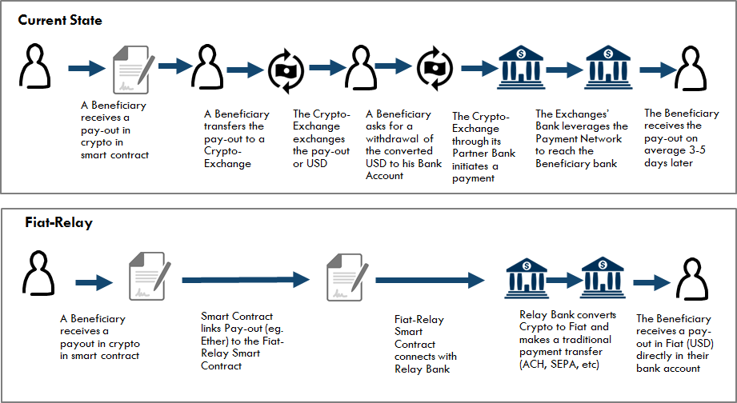

# Fiat-Relay

Fiat-Relay is an Ethereum Smart Contract and Banking solution that covers one of the immediate needs to the blockchain industry. Namely to provide an low cost, fast and automated solution to pay-out any Ether Balance that is the outcome of a Smart Contract that exist on the Ethereum blockchain.
Currently Smart contracts on Ethereum network are covered in Ether. Other Blockchains are dealing with BTC or any other crypto currency. Due to the nature of the blockchain technology fiat currency can only be obtained after a user converts his or her crypto currency via an exchange (Coinbase, Poloniex, ShapeShift) and instructs the exchange to pay-out the fiat currency back to its original bankaccount on file. This process requires multiple steps by the user, and could lead up to 5-7 days of delay before final fiat converted amount is deposited on a bankaccount

Fiat Relay is an open-source initiative by Capgemini to provide an automated solution for existing smart contracts on Ethereum to immediately connect with a service to exchange  crypto currency to fiat and for payment delivery of the converted amount  through the regular banking payment network to an identified beneficiary.  
This solution requires no need for the user to become a client of an existing crypto exchange or requires any manual action from the beneficiary for receiving the Pay-out amount in USD, provided that all mandatory and required payment information is available to the Fiat-Relay contract

## functionality
The main functionality this solution provides include:

1. verification of an Ethereum message that contains the Ether that is specified to be paid to a beneficiary
(eg. An Ethereum Contract has provided a payment for X amount of Ether to the Fiat-Relay smart contract)
1. verification that payment details information is available for the disbursement of the Ether to the beneficiary
1. Ability to update of the payment status based on the information received from the Bank and the Fiat Payment network
1. Ability to return the ether funds back to the Originating Ethereum contract in case of failures (eg. insufficient or incorrect payment information, suspicious payment activity)

Note: In Ethereum Contracts have the ability to send "messages" to other contracts. Messages are virtual objects that are never serialized and exist only in the Ethereum execution environment. A message contains:
* The sender of the message (implicit)
* The recipient of the message (in this case the fiat-relay smart contract)
* The amount of ether to transfer alongside the message: This is the amount to be converted
* Optional data fields (See Payment Information section)
* A STARTGAS value

Note: The gas allowance assigned by a transaction or contract applies to the total gas consumed by that transaction and all sub-executions. For example, if an external actor A sends a transaction to B with 1000 gas, and B consumes 600 gas before sending a message to C, and the internal execution of C consumes 300 gas before returning, then B can spend another 100 gas before running out of gas.
(source - https://github.com/ethereum/wiki/wiki/White-Paper#ethereum-accounts)

----

# How it works
## Fiat Conversion and Payment

The following diagram covers the base flow scenario that covers the situation where a smart contract has created a pay-out for a beneficiary in crypto-currency, that is consequently exchanged in fiat currency and a payment transfer is made to the identified beneficiary account holder who will receive the pay-out in his/her account 2-3 days later (based on the payment services SLA's from bank and the payment network)

Diagram 1

</a>

## Payment Status Notification
In the diagram below, the scenario describes the functionality the bank and the fiat-relay smart contract  provide to to the original smart contract about the status of the payment transfer and final settlement

Diagram 2

</a>


## Payment Return process
In the diagram below, the scenario describes the situation where a payment was not successful. This could be due to missing or incorrect account information. In this case the fiat amount is converted back to the original crypto currency. This is done at the spot rate, which could lead to an increase of decrease of the original amount. This is amount is deposited back to the return address specified in the original transaction

Diagram 3

</a>


## Architecture

The Fiat-Relay solution contains a number of different components:

1. A Fiat-relay Smart Contract: This is an Ethereum contract that can be leveraged by other Ethereum Contracts for paying a Beneficiary Person, Company or Organization the Fiat equivalent of the Ether Balance on an Ethereum Account
1. An Crypto Exchange Function:  This is an automated and real-time Ether to fiat Exchange (using an existing USD to Ether Exchange provider (eg. Poloniex or in the future Coinbase)
1. A Bank Payment Module: This is a Bank application that stores all records of the transactions and provides tools for customer service reps to investigate or follow up on on specific customer service issues. It provides payment translation services and integrates with the banks accounting system
1. A Bank Payment Processor: This is a traditional bank payment solution leveraged to provide payment services for clients of the bank

 </a>

</a>


Future Development:
1. A Customer Portal: This is a Bank Application that provides a customer friendly Blockexplorer view of the blokchain transactions and data available in the smart contract
1. A Mobile Notification Service: This notifies the User about the status of the payment


----

# Payment information
For the Fiat-Relay contract and the payment transfer service to be successful, additional payment information is necessary

This information is required:
* To identify the originator of the transaction
* To identify the beneficiary for the payment service
* And to guarantee compliance with all applicable laws (including AML, KYC and others as required)

Note: based on regulatory guidelines in the initial phase of the project the maximum fiat equivalent payment to any beneficiary is set to 1000 USD per transaction


The following payment information is required for the Fiat-Relay smart contract:
* `Originator Name`
* `Originator address 1`
* `Originator Address 2` - Optional
* `Originator City`
* `Originator State`
* `Originator Country`
* `Originator Telephone` - Optional
* `Originator email address` - Optional
* `Originator blockchain identity` (eg. Onename ID) - Optional
* `Beneficiary Name`
* `Beneficiary Bank Account number`
* `Beneficiary Bank ABA Number`
* `Beneficiary address 1`
* `Beneficiary Address 2` - Optional
* `Beneficiary City`
* `Beneficiary State`
* `Beneficiary Country`
* `Beneficiary Telephone` - Optional
* `Beneficiary email address` - Optional
* `Beneficiary blockchain identity (eg, Onename ID)` - Optional
* `Ether amount to transfer`
* `Ethereum Originating Account` - This is the  smart contract initiating the transaction
* `Ethereum Bank Account` - this is the bank owned Ethereum Account that will receive the funds in Ether
* `Return Ethereum Address` - This is the return address incase the payment transaction is incomplete or invalid
* `Reference Message` - Description that travels with the payment transaction

For payment services exceeding 3000 USD additional payment information maybe required
(see  FinCen regulation for Money Transmitters -  http://www.ecfr.gov/cgi-bin/text-idx?SID=2df5ac33e4575e7be6e95689037843e1&mc=true&node=se31.3.1010_1410&rgn=div8)

----

# API Services

To be completed


----

# License

See [full MIT License](LICENSE) including:
```
THE SOFTWARE IS PROVIDED "AS IS", WITHOUT WARRANTY OF ANY KIND, EXPRESS OR
IMPLIED, INCLUDING BUT NOT LIMITED TO THE WARRANTIES OF MERCHANTABILITY,
FITNESS FOR A PARTICULAR PURPOSE AND NONINFRINGEMENT. IN NO EVENT SHALL THE
AUTHORS OR COPYRIGHT HOLDERS BE LIABLE FOR ANY CLAIM, DAMAGES OR OTHER
LIABILITY, WHETHER IN AN ACTION OF CONTRACT, TORT OR OTHERWISE, ARISING FROM,
OUT OF OR IN CONNECTION WITH THE SOFTWARE OR THE USE OR OTHER DEALINGS IN
THE SOFTWARE.
```
